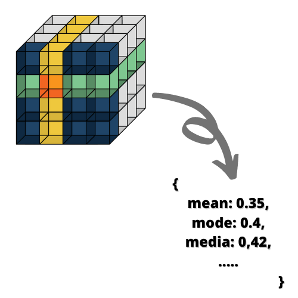

<!-- PROJECT LOGO -->
<br />
<p align="center">
  <a href="https://github.com/joaherrerama/search-ndvi">
    
  </a>

  <h3 align="center">Search and NDVI Calculation using STAC and COG </h3>
</p>


<!-- TABLE OF CONTENTS -->
<details open="open">
  <summary>Table of Contents</summary>
  <ol>
    <li>
      <a href="#about-the-project">About The Project</a>
      <ul>
        <li><a href="#shat-does-it?">What does it?</a></li>
        <li><a href="#statistics">Statistics</a></li>
        <li><a href="#limitations">Limitations</a></li>
        <li><a href="#dependencies">Dependencies</a></li>
      </ul>
    </li>
    <li>
      <a href="#getting-started">Getting Started</a>
      <ul>
        <li><a href="#prerequisites">Prerequisites</a></li>
        <li><a href="#installation">Installation</a></li>
      </ul>
    </li>
    <li><a href="#code">Code</a></li>
    <li><a href="#contact">Contact</a></li>
  </ol>
</details>


<!-- ABOUT THE PROJECT -->
## About The Project

The goal of script is to search for Sentinel 2 scenes within a provided geometry and compute an average NDVI (Normalized Difference Vegetation Index) for that area, for the latest available scene in that geometry. The output of such a script would be a single NDVI value (e.g. 0.72) representing the mean NDVI value of the image pixels in the selected geometry.

### What does it?

The code is currently under development. Therefore, there are a couple of bugs and functionalities that are still on developing state. By the moment the command *latest* is one working and calculate the user-defined statistics based on the latest scene available. 

The command argument *dates* is **still under development** and even thought is set up, the workflow for this command is not yet implemented.

### Statistics

The script allows the user the estimation of different statistics:

* **Mean:** NDVI mean represent the general value in the hole area. Be cautious about how to interpret this number.

* **Mode:** NDVI mode represent the more repetitive value found in the image. This might help to understand how the mean is related to the most frequent value.
* **Median:** The NDVI median might help you to understand the asymmetry of the data distribution compared to the mean value. the median is the value separating the higher half from the lower half of a data sample.
* **Maximum:** The NDVI maximum allow us to understand the maximum value found in the matrix, what might imply the existence of Forest or Dense vegetation coverages
* **Minimum:** The NDVI minimum allow us to understand the maximum value found in the matrix, what might imply the existence of Arid coverages
* **Standard deviation:** The NDVI std represent the spread of the data. A low standard deviation indicates that the values tend to be close to the mean (also called the expected value) of the set, while a high standard deviation indicates that the values are spread out over a wider range.

###  Limitations

* In currently state, the code limits the user to the latest image and applies a filter based on cloud percentage on the metadata of each scene. It represents that if the area of interest represents 30% of the image and the location has 20% of cloud coverage. It might happen that this 20% matches with all or part of your zone.

* It is noteworthy to mention that the statistics are a point of reference for the analyzed zone. A larger bias might be found at larger area (depends on the data properties)

* •	Execution time compromises the size of your inputs and the statistics selected, and single or temporal analysis.


### Dependencies

To built this script, the following concepts and libraries were applied:

* [Python](https://www.python.org/)
* [STAC](http://sat-utils.github.io/sat-api/)
* [COG](https://www.cogeo.org/)

#### Main Libraries

* [Sat-search](https://github.com/sat-utils/sat-search)
* [intake - stac](https://github.com/intake/intake-stac)
* [rasterio](https://rasterio.readthedocs.io/en/latest/)

<!-- GETTING STARTED -->
## Getting Started

the following script which calculates some statistics of an NDVI raster (Normalized difference vegetation index), is executed through a command line with the following structure:
    ```sh
     python .\S2ndvi_calc.py latest -h
     
     usage: Sentinel 2: NDVI Calculation latest [-h] [-cloudperc [CLOUDPERC]] [-stats {mean,median,mode,max,min,std} [{mean,median,mode,max,min,std} ...]] [-geometry [GEOMETRY]]
    optional arguments:
      -h, --help            show this help message and exit
      -cloudperc [CLOUDPERC]
                            Percentage of cloud cover in the scene (optional)
      -stats {mean,median,mode,max,min,std} [{mean,median,mode,max,min,std} ...]
                            descriptors to calculate (mean, median, mode, max, min, std) default -> [mean,mode,std] (optional)
      -geometry [GEOMETRY]  Study Area to analyse in GEOJSON format (optional)
    ```
It is important to mention that the NDVI is a vegetation index that allows to evaluate the vegetation level of a pixel. In this case the analysis statistics are calculated at the area level.

### Prerequisites

To install all the libraries. You can run the following command line:

* pip
  ```sh
    pip install -r requirements.txt
  ```

### Installation

1. Download/Clone the git repository
2. Open the Command windows and head the folder where the code is located
3. Create and environment in the folder (Optional)
4. Install all the libraries requires from requirements.txt
5. Run the command line
    ```sh
      python S2ndvi_calc.py latest -h
    ```
<!-- CONTRIBUTING -->
## Code

In this section is explained what does each .py files as well as the default:

1. Default (Folder): This folder contains some files that are require for both github (Logo) and code performing (Geojson and temporal files).
2. S2NDVI_calc.py :  Contains the command line logic and validation.
3. NDVICalc_functions.py : Contains all the logic to calculate the stats as well the code logic and processes. 


<!-- CONTACT -->
## Contact

Jorge Herrera - [@joaherrerama](https://twitter.com/joaherrerama) - herreram.jahm@gmail.com

LinkedIn: [https://www.linkedin.com/in/jorgeaherreram/](https://www.linkedin.com/in/jorgeaherreram/)
GitHub: [https://github.com/joaherrerama/](https://github.com/joaherrerama/)


